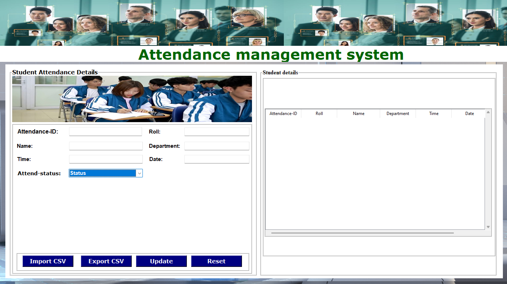

# Student management system
## Introduction
Welcome to the University Student Management System with a face recognition attendance feature!


# University Student Management System
## Overview
The University Student Management System is a multitasking application developed to manage student information and perform attendance tracking using facial recognition through a camera and OpenCV. This application is designed to simplify the management process and monitor student participation in classes, events, and other activities.
## Features
### 1. **Face Recognition Attendance**
The system utilizes OpenCV technology for face detection and attendance tracking based on facial recognition. The attendance process is quick and accurate, saving time and effort compared to traditional methods.

### 2. **Data Storage**
Attendance data is stored in a CSV file, providing administrators with an easy way to track and analyze information. The CSV file offers a flexible data structure, convenient for data export and integration with other systems.

## User Guide
1. **Download project**
    ```
    git clone https//github.com/NguyAnhQuan/face_recognition_system_eaut.git
    ```
2. **Installation Requirements**

   - Ensure you have installed OpenCV and related libraries.
   - Check the camera connection to ensure the attendance tracking feature works correctly.
   - Or you can install the library through the following simple way
     ```
     cd face_recognition system
     pip install -r requirements.txt
     ```
3. **Run the Application**
   - Open the terminal and enter the command to start the system.
      ```
      python main.py 
      ```
   - You are an admin, please check your students
4. **Get attendance data**
   - csv file containing login information will be saved in the folder face_recognition system
     ```
     type face_recognition system\DiemDanh.csv
     ```

# Image while running
## 1. **Connect SQL Server**


## 2. **Run main.py**


## 3. **Open main local**
application when first opened


Perform data entry on the application

## 4. **Import and export csv files visually**

## 5. **Take attendance**


### View csv files and receive attendance results. The application can be used in exam proctoring situations to avoid taking the exam on behalf of or forgery.
